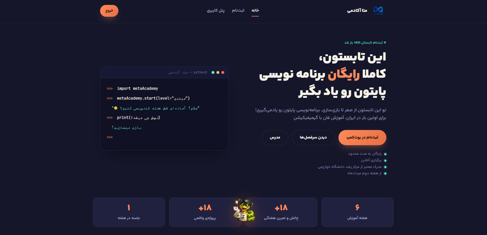
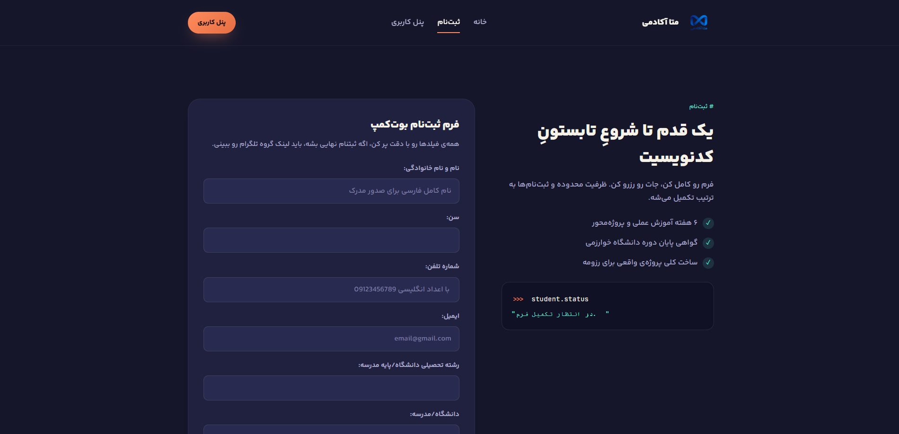
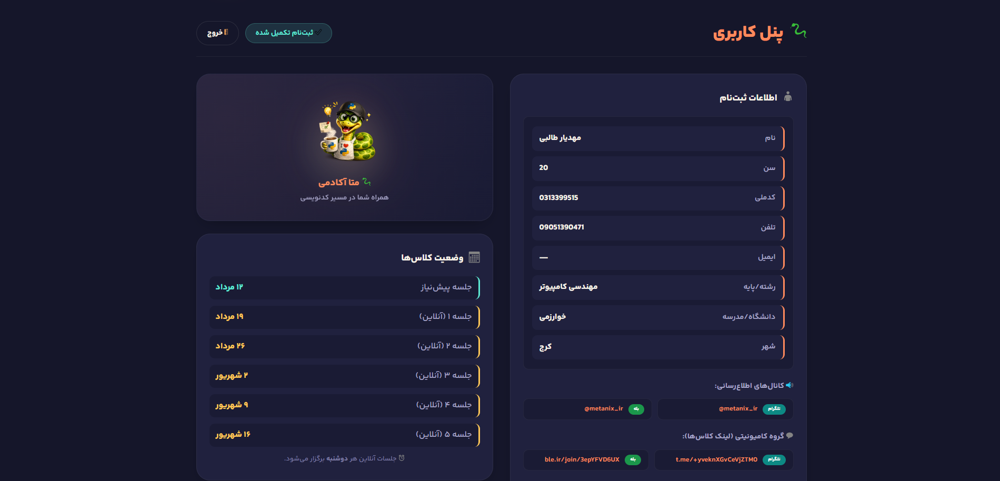
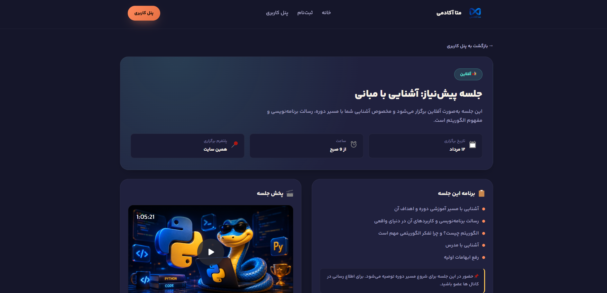
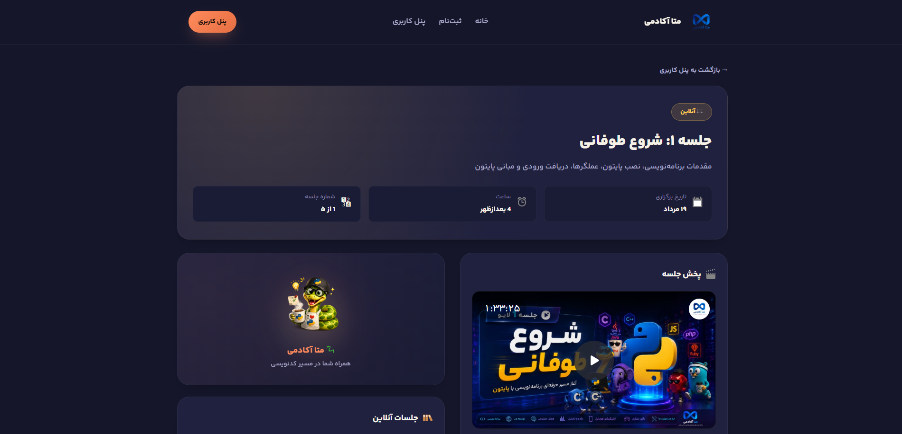
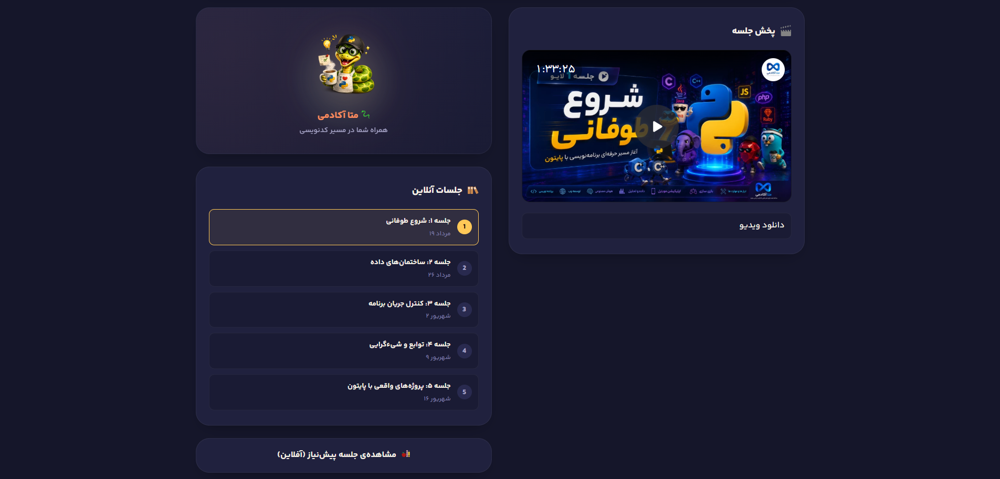
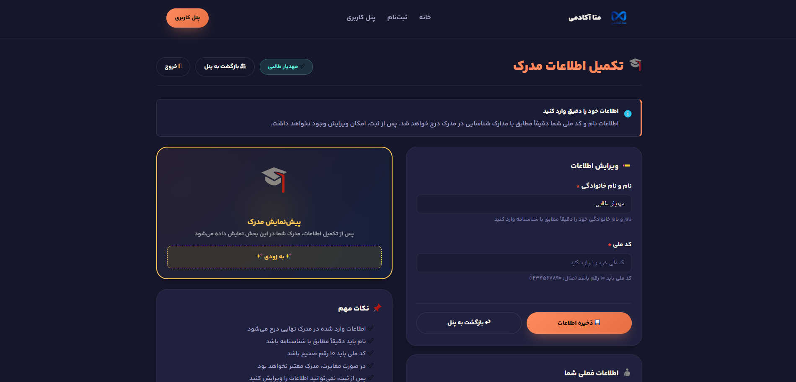
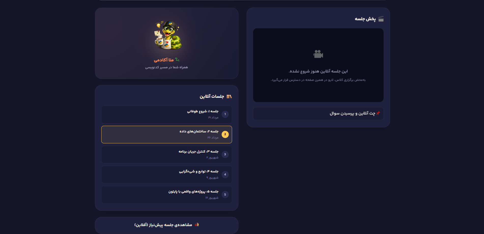

<div align="center">


# metaAcademy

**A full-stack Django platform for running a coding bootcamp — from student registration to live class sessions and certification.**

<p align="center">
  <table>
    <tr>
      <td align="center"></td>
      <td align="center"></td>
      <td align="center"></td>
      <td align="center"></td>
    </tr>
    <tr>
      <td align="center"></td>
      <td align="center"></td>
      <td align="center"></td>
      <td align="center"></td>
    </tr>
  </table>
</p>

🌐 **Live:** [mtaAcademy.ir](https://mtaAcademy.ir)

</div>

---

## ✨ What is this?

**metaAcademy** is the engine behind a real, live-running Persian coding bootcamp. It's not a template or a toy project — it's the production backend that handles everything a bootcamp actually needs:

- Students land on the site, **register in seconds**, and instantly get their own personal dashboard.
- Every session — whether it's a **live-streamed class** or a **recorded offline session** — lives in a clean, distraction-free player view.
- When the bootcamp wraps up, students can request and preview their **completion certificate**.
- Behind the curtain, the team manages the whole cohort through a custom **admin toolkit**, including one-click **Excel import/export** of the student roster.

Built solo, end-to-end, with Django's class-based views doing the heavy lifting.

---

## 🚀 Core Features

### 🎓 For Students
- **One-step registration** — name, age, phone, national code, email, school/field of study, city, and how they heard about the bootcamp, all validated server-side (Iranian mobile number format, national code, email).
- **Smart duplicate handling** — if a phone number is already registered, the user is transparently routed to their existing account instead of hitting a wall.
- **Real login system** — a two-step flow: enter your phone/email → set a password (for first-time users) or log in with your existing one. Passwords are hashed, never stored in plain text.
- **Session-based auth panel** — a lightweight, cookie-free-of-headaches authentication layer built on Django sessions rather than the default auth app, tailored specifically for this use case.
- **Live classes** — each session has a dedicated page with an embedded live stream and live chat link, switching automatically between "live" and "recorded" states.
- **Offline/prerequisite sessions** — a separate track for pre-recorded prep material.
- **Certificate flow** — students can review and correct their name/national code before their certificate is generated.

### 🛠️ For Admins
- **Custom Django Admin** panel for managing students and per-session video/chat links.
- **Staff-only student roster** (`/list/`) protected with `LoginRequiredMixin` + `UserPassesTestMixin`.
- **One-click Excel export** of all registered students via `openpyxl` — instantly shareable spreadsheets.
- **Excel import** to bulk-load student data.
- **Per-session live-link control** — flip a session between live and on-demand, and swap stream/chat URLs, without touching code.

---

## 🏗️ Tech Stack

| Layer | Technology |
|---|---|
| **Backend** | [Django 6.0](https://www.djangoproject.com/) — pure **class-based views** (`CreateView`, `ListView`, `TemplateView`, custom `View` + mixins) |
| **Database** | PostgreSQL (via `psycopg2-binary`) |
| **Config** | `django-environ` for clean `.env`-based settings |
| **Spreadsheets** | `openpyxl` for Excel import/export of the student roster |
| **Auth** | Custom session-based auth layer for students, standard Django auth for staff |
| **Frontend** | Django templates + hand-crafted CSS/JS (no frontend framework — fast, lightweight pages) |
| **Server** | WSGI/ASGI-ready (`gunicorn`-compatible) |

### Project Structure

```
metaAcademy/
├── bootcamp/           # Project config (settings, urls, wsgi/asgi)
├── core/                 # The main app
│   ├── models.py         # Student & VideoLink models
│   ├── views.py           # All class-based views (registration, auth, classes, certificate...)
│   ├── forms.py           # Registration, login, certificate & Excel forms
│   ├── admin.py           # Custom Django admin config
│   └── migrations/
├── templates/            # home, register, check (login), class_online/offline, certificate, students...
├── static/
│   ├── css/ js/ fonts/ img/
└── requirements.txt
```

---

## ⚙️ Getting Started

### 1. Clone & set up a virtual environment

```bash
git clone https://github.com/MahdyarTlb/metaAcademy.git
cd metaAcademy
python -m venv venv
source venv/bin/activate   # Windows: venv\Scripts\activate
```

### 2. Install dependencies

```bash
pip install -r requirements.txt
```

### 3. Configure environment variables

Create a `.env` file in the project root:

```env
SECRET_KEY=your-django-secret-key
DB_NAME=metaacademy
DB_USER=postgres
DB_PASSWORD=your-password
DB_HOST=localhost
DB_PORT=5432
```

### 4. Migrate & run

```bash
python manage.py migrate
python manage.py createsuperuser
python manage.py runserver
```

Visit `http://127.0.0.1:8000/` and you're in. 🎉

---

## 🗺️ Key Routes

| URL | Purpose |
|---|---|
| `/` | Landing page |
| `/register/` | Student registration |
| `/check/` | Login (phone/email → password) |
| `/check/set-password/` | First-time password setup |
| `/classes/online/<session_number>/` | Live/recorded class player |
| `/classes/offline/` | Offline/prerequisite session |
| `/certificate/` | Certificate info review |
| `/list/` | Staff-only student roster |
| `/export-excel/` · `/import-excel/` | Roster Excel I/O |

---

## 📌 About the domain

This project powers **[mtaAcademy.ir](https://mtaAcademy.ir)**, an active bootcamp registration and delivery platform — meaning every feature here is battle-tested against real students, real sessions, and real deadlines, not just a spec sheet.

---

<div align="center">

Made with Django, PostgreSQL, and way too much coffee ☕

</div>